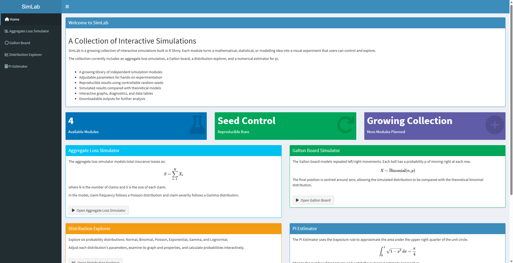
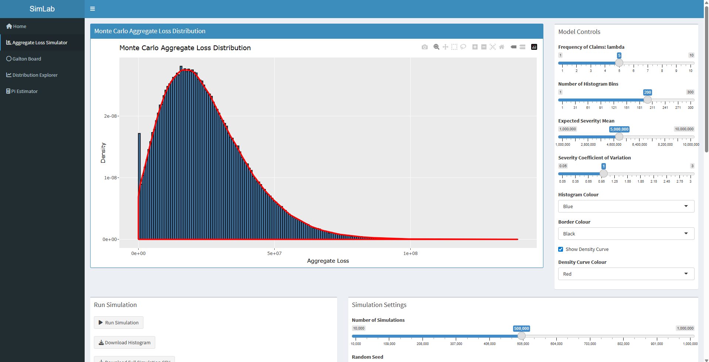
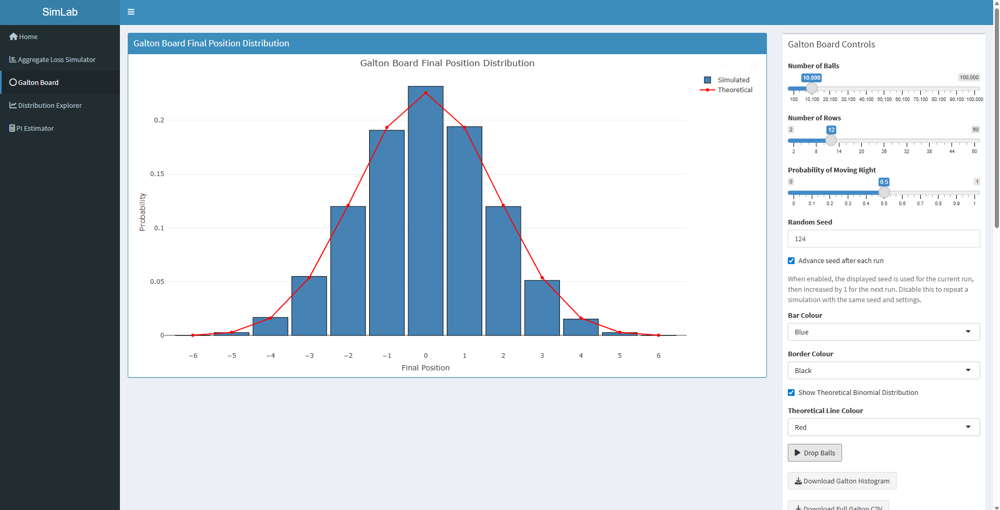
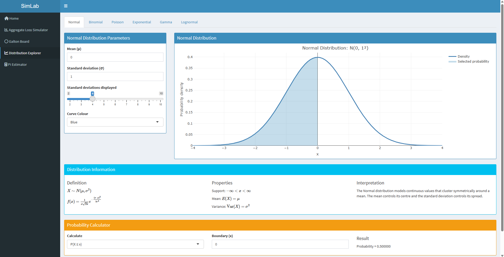
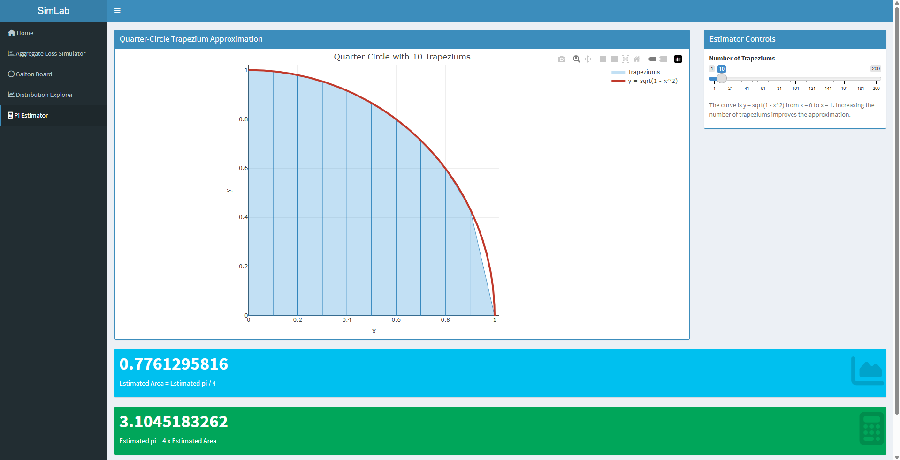

# SimLab

**SimLab** is an interactive statistics and probability application built in **R Shiny**.

The project brings together a collection of simulations, probability distributions, and numerical methods in one interactive environment. It is designed both as a learning tool and as a demonstration of statistical programming in R.

SimLab currently contains four main modules:

* Aggregate Loss Simulator
* Galton Board
* Distribution Explorer
* π Estimator

---

## Overview

SimLab allows users to experiment with statistical models by changing parameters and immediately seeing how the results change.

Rather than only displaying formulas, the application allows the user to interact with the underlying mathematics through simulations, graphs, probability calculations, and numerical approximations.

The project was built using R and the Shiny framework, with interactive visualisations created using Plotly and ggplot2.

---
## Live App

🚀 **[Launch SimLab](https://benjamin-bilyak.shinyapps.io/SimLab/)**
---

## Modules

### 1. Aggregate Loss Simulator

The Aggregate Loss Simulator models the total financial loss generated by a random number of claims.

The model uses:

* **Poisson distribution** for claim frequency
* **Gamma distribution** for claim severity
* Monte Carlo simulation to generate aggregate losses

Users can control parameters including:

* Expected number of claims
* Mean claim severity
* Coefficient of variation
* Number of simulations
* Histogram bins
* Random seed

The simulator produces an interactive aggregate-loss distribution together with summary statistics and simulation results.

---

### 2. Galton Board

The Galton Board demonstrates how repeated random binary events can generate a **binomial distribution**.

Each simulated ball moves left or right as it passes through each row of pins.

Users can change:

* Number of balls
* Number of rows
* Probability of moving in either direction
* Random seed

The simulated distribution can also be compared with the theoretical binomial distribution.

This module demonstrates the connection between simple random processes and probability distributions.

---

### 3. Distribution Explorer

The Distribution Explorer provides an interactive way to study common probability distributions.

Currently supported distributions include:

* Normal
* Binomial
* Poisson
* Exponential
* Gamma
* Lognormal

Users can modify the parameters of each distribution and observe how its shape changes.

The module also includes probability calculations, allowing users to explore how areas under probability distributions correspond to probabilities.

---

### 4. π Estimator

The π Estimator demonstrates how numerical integration can be used to approximate π.

The unit circle satisfies:

```text
x² + y² = 1
```

Therefore, the upper-right quarter of the circle can be written as:

```text
y = √(1 - x²)
```

The area between `x = 0` and `x = 1` is:

```text
π / 4
```

SimLab approximates this area using the **trapezium rule**.

The user can select the number of trapeziums used in the approximation and observe how the estimate converges towards π as the number of trapeziums increases.

---

## Getting Started

### Requirements

You will need **R** installed on your computer.

RStudio is recommended but is not required.

The following R packages are used by SimLab:

```r
shiny
shinydashboard
ggplot2
data.table
plotly
DT
```

---

## Installation

### 1. Clone the repository

Using Git:

```bash
git clone https://github.com/Benjamin-Bilyak/R-Stats-Projects.git
```

Alternatively, the repository can be cloned using **GitHub Desktop**.

---

### 2. Open the project folder

Navigate into the cloned repository:

```bash
cd R-Stats-Projects
```

---

### 3. Install the required R packages

Open R or RStudio and run:

```r
install.packages(c(
  "shiny",
  "shinydashboard",
  "ggplot2",
  "data.table",
  "plotly",
  "DT"
))
```

You only need to install these packages once.

---

### 4. Run SimLab

Open `app.R` and run:

```r
shiny::runApp()
```

Alternatively, when using RStudio, open `app.R` and click **Run App**.

SimLab will then open locally in your web browser.

---

## Screenshots

### Home



### Aggregate Loss Simulator



### Galton Board



### Distribution Explorer



### π Estimator



---

## Project Structure

```text
R-Stats-Projects/
│
├── app.R
├── README.md
├── LICENSE
├── .gitignore
│
└── screenshots/
    ├── home.png
    ├── aggregate-loss.png
    ├── galton-board.png
    ├── distribution-explorer.png
    └── pi-estimator.png
```

---

## Technologies Used

SimLab is primarily built using:

* **R** — statistical programming and simulation
* **Shiny** — interactive web application framework
* **shinydashboard** — dashboard interface
* **ggplot2** — statistical visualisation
* **Plotly** — interactive graphs
* **data.table** — data manipulation
* **DT** — interactive data tables

---

## Random Seeds and Reproducibility

Several SimLab simulations include optional seed controls.

A fixed random seed allows the same random simulation to be reproduced.

SimLab can also automatically advance the seed after a simulation, allowing users to switch between reproducible results and new random simulations.

This makes it possible to experiment with both deterministic and randomised Monte Carlo outputs.

---

## Purpose of the Project

SimLab was created as a personal statistics and programming project.

The main goals of the project are to:

* Develop practical experience with statistical programming
* Visualise mathematical and statistical concepts
* Explore Monte Carlo simulation
* Build interactive applications using R Shiny
* Connect mathematical theory with computational experiments

---

## Future Development

SimLab is still under development.

Possible future additions include:

* Additional probability distributions
* Further numerical methods
* New simulation modules
* Additional statistical visualisations
* Improved probability calculators
* Expanded educational explanations
* Performance improvements for large simulations

---

## Author

Created by **Benjamin Bilyak**.

GitHub:
https://github.com/Benjamin-Bilyak

Project repository:
https://github.com/Benjamin-Bilyak/R-Stats-Projects

---

## Licence

This project is available under the **MIT License**.

See the [LICENSE](LICENSE) file for further information.
